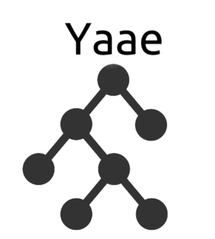
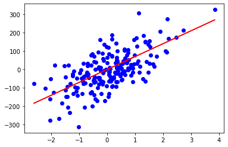
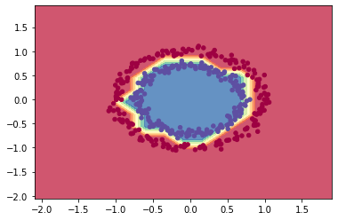

## Introduction

- Yaae (Yet another autodiff engine) is an [automatic differentiation][automatic-diff] engine written in Numpy which comes with a small neural networks library. It supports scalar operations as well as tensors operations and comes with various functions such as exponential, relu, sigmoid ... For educational puprose only.

- Here is my [blog post][blog-post] explaining how an automatic differentiation works and my design/implementation choices.

## Quickstart

- Let's compare a simple example using Yaae and Pytorch.

```python
# Yaae.
w1 = Node(2, requires_grad=True)
w2 = Node(3, requires_grad=True)
w3 = w2 * w1
w4 = w1.sin()
w5 = w3 + w4
z = w5
z.backward()
w1_yaae, w2_yaae, z_yaae = w1, w2, z

# Pytorch.
w1 = torch.Tensor([2]).double()
w1.requires_grad = True
w2 = torch.Tensor([3]).double()
w2.requires_grad = True
w3 = w2 * w1
w4 = w1.sin()
w5 = w3 + w4
z = w5
z.backward()
w1_torch, w2_torch, z_torch = w1, w2, z

# Forward pass.
assert z_yaae.data == z_torch.data.item() # True.
# Backward pass.
assert w1_yaae.grad.data ==  w1_torch.grad.item() # True.
assert w2_yaae.grad.data == w2_torch.grad.item() # True.
```

## Example of usage

- The files [demo_regression.ipynb][demo_regression] and [demo_classification.ipynb][demo_classification] are simple regression/classification problems solved using Yaae. As shown in the notebooks, here are the the results:

 

- If you are still skeptical, here is my [GAN][gan] implemented with Yaae.


## Installation

- Create a virtual environment in the root folder using [virtualenv][virtualenv] and activate it.

```bash
# On Linux terminal, using virtualenv.
virtualenv my_yaae_env
# Activate it.
source my_yaee_env/bin/activate
```

- Install **requirements.txt**.

```bash
pip install -r requirements.txt
# Tidy up the root folder.
python3 setup.py clean
```

<!---
Variables with links.
-->

[automatic-diff]: https://en.wikipedia.org/wiki/Automatic_differentiation
[blog-post]: https://hackmd.io/@bouteille/H19MWi_A8
[demo_regression]: https://github.com/3outeille/Yaae/blob/master/src/example/demo_regression.ipynb
[demo_classification]: https://github.com/3outeille/Yaae/blob/master/src/example/demo_classification.ipynb
[gan]: https://github.com/3outeille/GANumpy
[virtualenv]: https://packaging.python.org/guides/installing-using-pip-and-virtual-environments/
